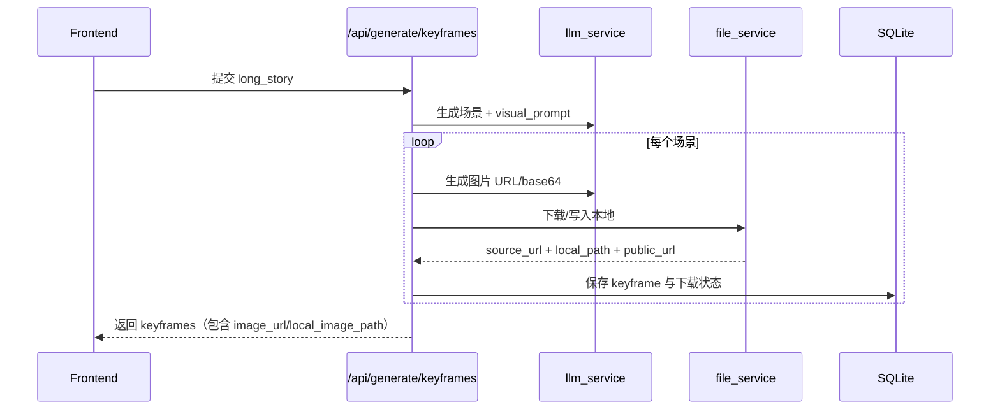
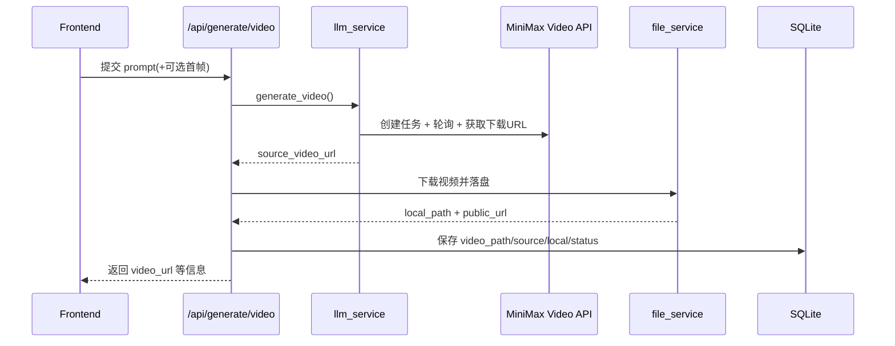

# DreamWeaver Backend 设计文档

## 1. 文档目标

本文档描述 `dreamweaver-backend` 的后端设计，包括：

- 系统定位与边界
- 分层架构与模块职责
- 数据模型与存储策略
- 核心业务流程（注册登录、生成链路、资源落盘）
- 配置、部署、运行与后续演进建议

适用对象：项目开发者、答辩评审、后续维护人员。

---

## 2. 系统概览

DreamWeaver Backend 是一个基于 FastAPI 的 AI 生成后端，支持以下闭环：

1. 用户注册 / 登录
2. 创建与管理项目
3. 按流程生成大纲、故事、关键帧图片、视频
4. 将生成资源（图片、视频）落盘并通过静态路由访问

### 2.1 关键技术栈

- Web 框架：FastAPI + Uvicorn
- 数据库：SQLite（默认），SQLAlchemy ORM
- 身份认证：JWT（Bearer）
- 文本生成：DeepSeek（OpenAI 兼容接口）
- 图片生成：MiniMax `/v1/image_generation`
- 视频生成：MiniMax 异步视频接口
- 文件服务：本地磁盘持久化 + StaticFiles

---

## 3. 架构设计

### 3.1 分层结构

```mermaid
flowchart TB
    C[Client / Frontend] --> R[FastAPI Routers]
    R --> S[Service Layer]
    S --> E[External AI APIs]
    R --> D[(SQLite)]
    S --> F[(Local Media Storage)]

    subgraph Routers
      R1[/auth]
      R2[/api/projects]
      R3[/api/generate]
    end

    subgraph Services
      S1[llm_service]
      S2[file_service]
    end

    R --> R1
    R --> R2
    R --> R3
    R3 --> S1
    R3 --> S2
```

### 3.2 目录职责

- `app/main.py`：应用入口、CORS、路由注册、静态目录挂载、启动初始化
- `app/config.py`：环境变量读取与统一配置
- `app/routers/`：HTTP 接口层（auth/projects/generation）
- `app/services/`：业务与外部服务集成（LLM、媒体落盘）
- `app/database/`：ORM 模型、会话、数据库初始化与轻量迁移
- `media/generated/`：生成媒体落盘目录（图片/视频）

---

## 4. 核心模块设计

## 4.1 鉴权模块（`auth`）

能力：

- 用户注册（密码 bcrypt 哈希）
- 用户登录（JWT 签发）
- 当前用户信息获取
- 头像上传与更新
- 修改密码

鉴权机制：

- 通过 `Authorization: Bearer <token>` 访问受保护接口
- 中间依赖 `get_current_user` 负责解码 JWT 并查用户

---

## 4.2 项目模块（`projects`）

能力：

- 项目创建、列表、详情
- 版本树查询（outline/story/keyframes 多版本）
- 手动保存版本（大纲、故事、关键帧）
- 项目删除（删除数据库关联记录 + 清理本地生成资源目录）
- 进度查询（`status` + `current_step`）

---

## 4.3 生成模块（`generation`）

主要接口：

- `POST /api/generate/outline`
- `POST /api/generate/story`
- `POST /api/generate/keyframes`
- `POST /api/generate/video`

职责：

1. 参数校验与用户权限校验
2. 调用 `llm_service` 生成内容
3. 调用 `file_service` 对图片/视频进行落盘
4. 将业务数据和媒体状态持久化到数据库

---

## 4.4 LLM 服务模块（`llm_service`）

### 文本能力

- 大纲生成：`generate_outline`
- 长故事生成：`generate_long_story`
- 关键帧场景提取：`generate_keyframe_scenes`

默认路由：

- 文本模型走 DeepSeek（`MODEL_OUTLINE/STORY/KEYFRAMES`）

### 图片能力

- `generate_image`：调用 MiniMax 文生图接口
- 返回 URL（或按配置返回 base64）

### 视频能力

- `generate_video`：MiniMax 异步流程
  - 创建任务
  - 轮询任务状态
  - 获取文件下载 URL

---

## 4.5 媒体存储模块（`file_service`）

目标：将生成的外部资源持久化到本地，避免仅依赖第三方临时 URL。

能力：

- `persist_generated_image(project_id, keyframe_id, image_ref)`
- `persist_generated_video(project_id, video_id, video_url)`
- `remove_project_generated_assets(project_id)`

支持输入：

- 图片：`http(s)` URL 或 `data:image/...` base64
- 视频：`http(s)` URL

落盘后输出：

- `source_*_url`：来源地址
- `local_*_path`：本地绝对路径
- `*_path`：可对外访问的静态 URL（如 `/media/generated/images/...`）

---

## 5. 数据模型设计

核心实体关系：

- `User 1-N Project`
- `Project 1-N Outline/Story/Keyframe/Video`
- `Story 1-N Keyframe`
- `Keyframe 1-N Video(可选)`

### 5.1 关键字段（生成资源）

`keyframes`：

- `image_path`：对外可访问 URL（优先本地静态地址）
- `source_image_url`：AI 平台返回源地址
- `local_image_path`：本地磁盘路径
- `download_status`：`success/failed`
- `download_error`：失败原因

`videos`：

- `video_path`：对外可访问 URL（优先本地静态地址）
- `source_video_url`：AI 平台返回源地址
- `local_video_path`：本地磁盘路径
- `download_status`：`success/failed`
- `download_error`：失败原因

### 5.2 兼容迁移策略

项目使用启动时轻量迁移（SQLite）：

- 启动后检查表字段是否存在
- 若缺失则执行 `ALTER TABLE ... ADD COLUMN`
- 保证老库可平滑升级，无需手动删库重建

---

## 6. 媒体落盘与访问设计

### 6.1 路径规划

- 根目录：`media/generated`
- 图片：`media/generated/images/{project_id}/{keyframe_id}.{ext}`
- 视频：`media/generated/videos/{project_id}/{video_id}.{ext}`

### 6.2 静态访问

- 挂载路由：`/media/generated`
- 浏览器可直接访问返回地址

### 6.3 与头像分离

- 头像仍位于 `uploads/avatars`
- 生成媒体与上传头像分离，避免混用存储空间和生命周期策略

---

## 7. 配置设计（`.env`）

建议分组：

### 基础运行

- `BACKEND_HOST`
- `BACKEND_PORT`
- `CORS_ORIGINS`
- `DATABASE_URL`
- `SECRET_KEY`

### 文本生成

- `DEEPSEEK_API_KEY`
- `MODEL_OUTLINE`
- `MODEL_STORY`
- `MODEL_KEYFRAMES`

### 图片生成（MiniMax）

- `MINIMAX_API_KEY`
- `MINIMAX_IMAGE_MODEL`
- `MINIMAX_IMAGE_ASPECT_RATIO`
- `MINIMAX_IMAGE_RESPONSE_FORMAT`

### 视频生成（MiniMax）

- `MINIMAX_VIDEO_MODEL`
- `MINIMAX_VIDEO_DURATION`
- `MINIMAX_VIDEO_RESOLUTION`
- `MINIMAX_VIDEO_POLL_INTERVAL`
- `MINIMAX_VIDEO_MAX_POLLS`

### 本地媒体

- `GENERATED_MEDIA_ROOT`
- `GENERATED_MEDIA_URL_PREFIX`
- `ASSET_DOWNLOAD_TIMEOUT_SECONDS`
- `ASSET_DOWNLOAD_RETRIES`

---

## 8. 关键业务流程

### 8.1 关键帧生成 + 图片落盘



### 8.2 视频生成 + 落盘



---

## 9. 错误处理策略

- 外部接口失败：抛出明确错误信息，HTTP 500 返回 detail
- 下载失败：不阻断主流程写库，记录 `download_status=failed` 和 `download_error`
- 参数错误：使用 FastAPI / Pydantic 自动返回 4xx

建议后续补充：

- 统一错误码（业务码）
- 下载失败重试任务接口
- 超时与限流告警

---

## 10. 部署与运行

### 10.1 本地运行

1. 创建并激活虚拟环境
2. 安装依赖
3. 配置 `.env`
4. 启动：
   `python -m uvicorn app.main:app --host 127.0.0.1 --port 8000 --reload`

### 10.2 Docker 运行

项目提供 `Dockerfile`，可构建后以 8000 端口运行。

注意：

- 确保容器内挂载/持久化 `media/generated`，避免容器重建导致媒体丢失

---

## 11. 当前已知风险与优化建议

1. `story` 创建分支存在请求字段使用不一致风险（建议统一 `StoryRequest` 语义）
2. 视频接口为同步轮询，长任务会占用请求线程（建议改异步任务队列）
3. 目前是轻量迁移机制，后续建议引入 Alembic 管理版本化迁移
4. 资源清理目前在“删除项目”触发，建议增加定期清理孤儿文件任务
5. 建议增加集成测试（auth + generate + 落盘 + 删除）作为回归保障

---

## 12. 结论

当前后端已具备“用户-项目-AI生成-本地资源持久化”的完整闭环能力，架构清晰、便于迭代。  
后续优先方向建议为：异步化长任务、完善迁移体系、增强稳定性与可观测性。

